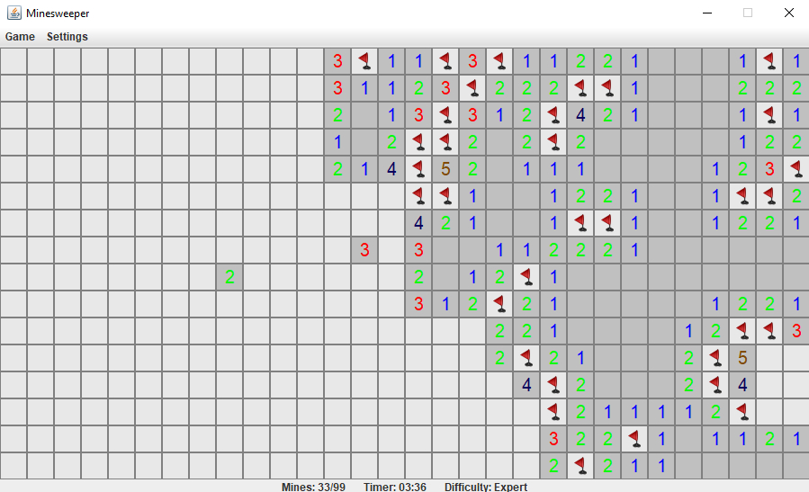

# Minesweeper
Simple minesweeper developed in a few of days to practise with the Swing framework.

# :bulb: Features

 - Three difficulty level (beginner, intermediate and expert)
 - Game timer (it can be disabled from settings)
 - You can place flags to highlight mines

# :framed_picture: Screenshot

  

# :joystick: Keys
Press the left mouse button to reveal a cell.

Press the right mouse button to place a flag.

# :computer: How to compile this project
From the root folder:

    javac -d ./ src/util/*.java
    javac -d ./ src/model/*.java
    javac -d ./ src/view/*.java
    javac -d ./ src/controller/*.java
    javac Main.java
At the end, run `Main.java`

# :page_with_curl: License
Distributed under the MIT License. See [here](https://github.com/vincenzocorso/minesweeper/blob/master/LICENSE) for more information.

